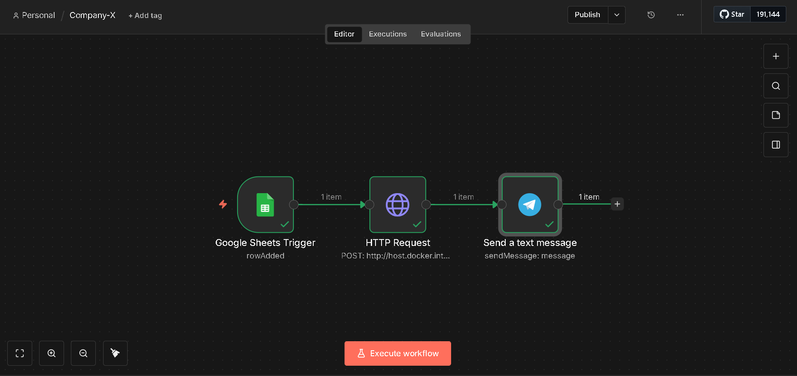
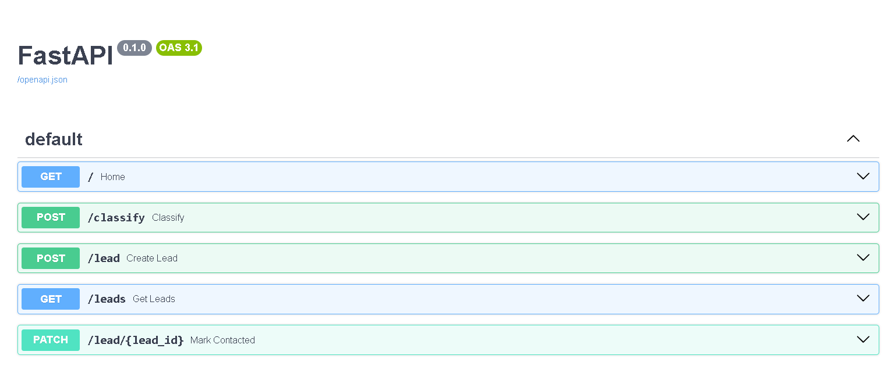
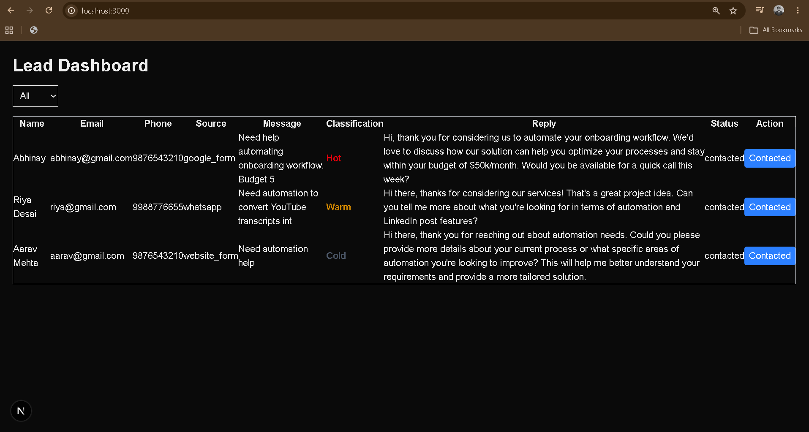

# AI Lead Automation System

## Overview

This project is a simple AI-powered Lead Automation System.

The system automates lead intake, lead qualification, AI-generated responses, and lead management through a simple dashboard.

### Features

* Accepts new leads through an API endpoint
* Uses a Local LLM (Ollama + Llama 3) to classify leads as:
  * Hot
  * Warm
  * Cold
* Generates a personalized reply for each lead
* Stores leads in SQLite
* Displays leads in a Next.js dashboard
* Filters leads by classification
* Allows users to mark leads as contacted
* Uses n8n to automate lead ingestion from Google Sheets
* Sends Telegram notifications when new leads arrive

---

# Architecture

```text
Google Sheet
      |
      v
     n8n
      |
      v
 FastAPI Backend
      |
      v
 Ollama (Llama3)
      |
      v
    SQLite
      |
      v
 Next.js Dashboard
```

## Workflow

```text
New Lead Added To Google Sheet
              |
              v
        n8n Trigger
              |
              v
      POST /lead API
              |
              v
     Lead Classification
              |
              v
      Generate Reply
              |
              v
      Store In SQLite
              |
              +-----> Telegram Notification
              |
              v
      Display In Dashboard
```

---

# Tech Stack

## Backend

* Python
* FastAPI
* SQLAlchemy
* SQLite
* Ollama
* Llama 3

## Frontend

* Next.js
* React
* Tailwind CSS
* Axios

## Automation

* n8n
* Google Sheets
* Telegram Bot

---

# Project Structure

```text
lead-automation/

├── backend/
│   ├── app.py
│   ├── database.py
│   ├── models.py
│   ├── schemas.py
│   ├── llm.py
│   ├── leads.db
│   └── requirements.txt
│
├── frontend/
│   ├── app/
│   ├── services/
│   ├── package.json
│   └── ...
│
├── n8n/
│   └── workflow.json
│
└── README.md
```

---

# Backend Setup

## Navigate to backend

```bash
cd backend
```

## Create virtual environment

```bash
python -m venv venv
```

### Windows

```bash
venv\Scripts\activate
```

### Linux / Mac

```bash
source venv/bin/activate
```

## Install dependencies

```bash
pip install -r requirements.txt
```

## Start Ollama

```bash
ollama run llama3
```

## Run FastAPI

```bash
uvicorn app:app --reload
```

Backend runs at:

```text
http://localhost:8000
```

Swagger Documentation:

```text
http://localhost:8000/docs
```

---

# Frontend Setup

Navigate to frontend:

```bash
cd frontend
```

Install dependencies:

```bash
npm install
```

Start development server:

```bash
npm run dev
```

Frontend runs at:

```text
http://localhost:3000
```

---

# n8n Setup

Start n8n:

```bash
docker start n8n
```

or

```bash
n8n start
```

Open:

```text
http://localhost:5678
```

Import:

```text
n8n/workflow.json
```

Configure:

* Google Sheets credentials
* Telegram credentials
* Backend API URL

---

# API Endpoints

## POST /classify

Classifies a lead message and generates a reply.

### Request

```json
{
  "message": "Need automation help. Budget 50k. Can we schedule a call?"
}
```

### Response

```json
{
  "classification": "Hot",
  "suggested_reply": "Thank you for reaching out. We'd be happy to discuss your automation requirements."
}
```

---

## POST /lead

Creates a new lead.

### Request

```json
{
  "name": "John Doe",
  "email": "john@example.com",
  "phone": "9876543210",
  "source": "website_form",
  "message": "Need automation support"
}
```

---

## GET /leads

Returns all stored leads.

---

## PATCH /lead/

Marks a lead as contacted.

---

# Dashboard Features

* View all leads
* Filter by:
  * Hot
  * Warm
  * Cold
* View AI-generated replies
* Mark leads as contacted

---

# Assumptions

* Local Ollama instance is running
* Llama 3 model is installed
* SQLite is sufficient for assignment requirements
* Authentication is intentionally omitted as per assignment instructions

---

# Trade-offs

### SQLite instead of PostgreSQL

SQLite was chosen because it is lightweight and sufficient for a local assignment.

### Local LLM instead of Cloud LLM

Ollama was used to avoid API costs and keep the project fully local.

### Simple UI

The dashboard focuses on functionality rather than design, as requested in the assignment.

---

# Improvements With More Time

If given additional time, I would:

1. Add user authentication
2. Add pagination and search
3. Add lead analytics dashboard
4. Add role-based access control
5. Add Docker Compose for one-command startup
6. Add automated tests
7. Add lead scoring confidence values
8. Add email integration for sending replies directly
9. Deploy using AWS/GCP/Azure
10. Replace SQLite with PostgreSQL

---

# Libraries and Tools Used

| Tool          | Purpose                                |
| ------------- | -------------------------------------- |
| FastAPI       | Backend API                            |
| SQLAlchemy    | Database ORM                           |
| SQLite        | Data Storage                           |
| Ollama        | Local LLM Runtime                      |
| Llama 3       | Lead Classification & Reply Generation |
| Next.js       | Frontend Dashboard                     |
| Axios         | API Communication                      |
| Tailwind CSS  | Styling                                |
| n8n           | Workflow Automation                    |
| Google Sheets | Lead Source                            |
| Telegram      | Notifications                          |

---

# Demo Flow

1. Add a lead to Google Sheets
2. n8n trigger detects the new row
3. Lead is sent to FastAPI
4. Ollama classifies the lead
5. Suggested reply is generated
6. Lead is stored in SQLite
7. Telegram notification is sent
8. Lead appears in Next.js dashboard
9. User marks lead as contacted

---

# Screenshots:







# Author

Abhinay Mahato

Automation & AI Workflow Associate
